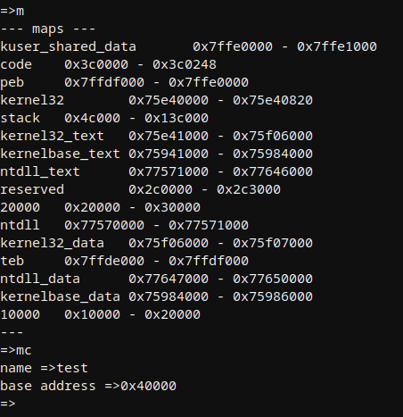
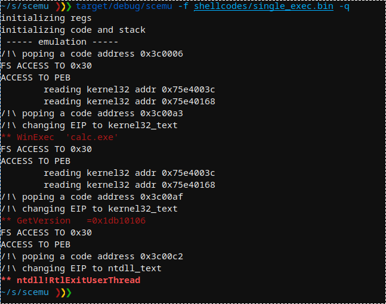
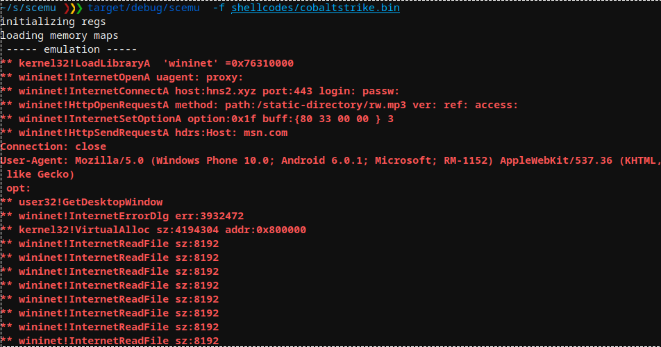
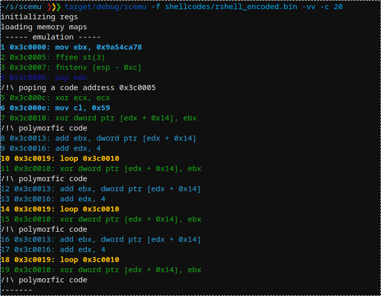

# scemu
x86 32/64bits emulator, for securely emulating malware and other stuff. 

## Some Videos
https://www.youtube.com/@JesusOlmos-wm8ch/videos

## Automation

Python apps https://pypi.org/search/?q=pyscemu

Rust apps https://crates.io/crates/libscemu

## Features
- 📦 rust safety, good for malware. 
	- All dependencies are in rust.
	- zero unsafe{} blocks.
- ⚡ very fast emulation (much faster than unicorn) 
	- 2,000,000 instructions/second
	- 379,000 instructions/second printing every instruction -vv.
- powered by iced-x86 rust dissasembler awesome library.
- iteration detector.
- memory and register tracking.
- colorized.
- stop at specific moment and explore the state or modify it.
- 180 CPU instructions implemented.
- 121 winapi 32bits implemented of 6 dlls.
- 75 winapi 64bits implemented of 8 dlls.
- all linux syscalls.
- SEH chains.
- vectored exception handler.
- PEB, TEB structures.
- dynamic linking.
- IAT binding.
- memory allocator.
- react with int3.
- non debugged cpuid.
- 32bits and 64bits shellcode emulation.
- pe32 and pe64 executables emulation.
- fully emulation with known payloads:
	- metasploit shellcodes.
	- metasploit encoders.
	- cobalt strike.
	- shellgen.
	- guloader (not totally for now, but arrive further than the debugger)
    - mars stealer pe32.
- partial emulation with complex malware functions:
    - guloader
    - xloader
    - danabot

## pyscemu vs malware
- raccoon, strings decryption
- vidar, strings decryption
- xloader, total decry
- lokibot, api deobfuscatiuon
- mars unpacking and getting ioc
- shikata decoding and getting ioc
- danabot get strings

## TODO
    - elf64 
    - guloader
    - more winapi implementations and banzai mode.
    - more cpu instructions


## Usage
```
SCEMU emulator for Shellcodes 0.4.0   32bits and 64bits
@sha0coder

USAGE:
    scemu [FLAGS] [OPTIONS]

FLAGS:
    -6, --64bits      enable 64bits architecture emulation
    -e, --endpoint    perform communications with the endpoint, use tor or vpn!
    -h, --help        Prints help information
    -l, --loops       show loop interations, it is slow.
    -m, --memory      trace all the memory accesses read and write.
    -n, --nocolors    print without colors for redirectin to a file >out
    -r, --regs        print the register values in every step.
    -p, --stack       trace stack on push/pop
    -V, --version     Prints version information
    -v, --verbose     -vv for view the assembly, -v only messages, without verbose only see the api calls and goes
                      faster

OPTIONS:
    -b, --base <ADDRESS>               set base address for code
    -c, --console <NUMBER>             select in which moment will spawn the console to inspect.
    -C, --console_addr <ADDRESS>       spawn console on first eip = address
    -a, --entry <ADDRESS>              entry point of the shellcode, by default starts from the beginning.
    -f, --filename <FILE>              set the shellcode binary file.
    -i, --inspect <DIRECTION>          monitor memory like: -i 'dword ptr [ebp + 0x24]
    -M, --maps <PATH>                  select the memory maps folder
    -R, --reg <REGISTER1,REGISTER2>    trace a specific register in every step, value and content
    -s, --string <ADDRESS>             monitor string on a specific address

```

## Some use cases

scemu emulates a simple shellcode detecting the execve() interrupt.


We select the line to stop and inspect the memory.


After emulating near 2 million instructions of GuLoader win32 in linux, faking cpuid's and other tricks in the way, arrives to a sigtrap to confuse debuggers. 


Example of memory dump on the api loader.


There are several maps by default, and can be created more with apis like LoadLibraryA or manually from the console.



Emulating basic windows shellcode based on LdrLoadDLl() that prints a message:


The console allow to view an edit the current state of the cpu:
```
--- console ---
=>h
--- help ---
q ...................... quit
cls .................... clear screen
h ...................... help
s ...................... stack
v ...................... vars
r ...................... register show all
r reg .................. show reg
rc ..................... register change
f ...................... show all flags
fc ..................... clear all flags
fz ..................... toggle flag zero
fs ..................... toggle flag sign
c ...................... continue
ba ..................... breakpoint on address
bi ..................... breakpoint on instruction number
bmr .................... breakpoint on read memory
bmw .................... breakpoint on write memory
bc ..................... clear breakpoint
n ...................... next instruction
eip .................... change eip
push ................... push dword to the stack
pop .................... pop dword from stack
fpu .................... fpu view
md5 .................... check the md5 of a memory map
seh .................... view SEH
veh .................... view vectored execption pointer
m ...................... memory maps
ma ..................... memory allocs
mc ..................... memory create map
mn ..................... memory name of an address
ml ..................... memory load file content to map
mr ..................... memory read, speficy ie: dword ptr [esi]
mw ..................... memory read, speficy ie: dword ptr [esi]  and then: 1af
md ..................... memory dump
mrd .................... memory read dwords
mds .................... memory dump string
mdw .................... memory dump wide string
mdd .................... memory dump to disk
mt ..................... memory test
ss ..................... search string
sb ..................... search bytes
sba .................... search bytes in all the maps
ssa .................... search string in all the maps
ll ..................... linked list walk
d ...................... dissasemble
dt ..................... dump structure
enter .................. step into
```

The cobalt strike api loader is the same that metasploit, emulating it:


Cobalt Strike API called:



Metasploit rshell API called:


Metasploit SGN encoder using few fpu to hide the polymorfism:


Metasploit shikata-ga-nai encoder that also starts with fpu:


Displaying PEB structure:
```
=>dt
structure=>peb
address=>0x7ffdf000
PEB {
    reserved1: [
        0x0,
        0x0,
    ],
    being_debugged: 0x0,
    reserved2: 0x0,
    reserved3: [
        0xffffffff,
        0x400000,
    ],
    ldr: 0x77647880,
    process_parameters: 0x2c1118,
    reserved4: [
        0x0,
        0x2c0000,
        0x77647380,
    ],
    alt_thunk_list_ptr: 0x0,
    reserved5: 0x0,
    reserved6: 0x6,
    reserved7: 0x773cd568,
    reserved8: 0x0,
    alt_thunk_list_ptr_32: 0x0,
    reserved9: [
        0x0,
...
```

Displaying PEB_LDR_DATA structure:
```
=>dt
structure=>PEB_LDR_DATA
address=>0x77647880
PebLdrData {
    length: 0x30,
    initializated: 0x1,
    sshandle: 0x0,
    in_load_order_module_list: ListEntry {
        flink: 0x2c18b8,
        blink: 0x2cff48,
    },
    in_memory_order_module_list: ListEntry {
        flink: 0x2c18c0,
        blink: 0x2cff50,
    },
    in_initialization_order_module_list: ListEntry {
        flink: 0x2c1958,
        blink: 0x2d00d0,
    },
    entry_in_progress: ListEntry {
        flink: 0x0,
        blink: 0x0,
    },
}
=>
```

Displaying LDR_DATA_TABLE_ENTRY and first module name
```
=>dt
structure=>LDR_DATA_TABLE_ENTRY
address=>0x2c18c0
LdrDataTableEntry {
    reserved1: [
        0x2c1950,
        0x77647894,
    ],
    in_memory_order_module_links: ListEntry {
        flink: 0x0,
        blink: 0x0,
    },
    reserved2: [
        0x0,
        0x400000,
    ],
    dll_base: 0x4014e0,
    entry_point: 0x1d000,
    reserved3: 0x40003e,
    full_dll_name: 0x2c1716,
    reserved4: [
        0x0,
        0x0,
        0x0,
        0x0,
        0x0,
        0x0,
        0x0,
        0x0,
    ],
    reserved5: [
        0x17440012,
        0x4000002c,
        0xffff0000,
    ],
    checksum: 0x1d6cffff,
    reserved6: 0xa640002c,
    time_date_stamp: 0xcdf27764,
}
=>
```


A malware is hiding something in an exception
```
3307726 0x4f9673: push  ebp
3307727 0x4f9674: push  edx
3307728 0x4f9675: push  eax
3307729 0x4f9676: push  ecx
3307730 0x4f9677: push  ecx
3307731 0x4f9678: push  4F96F4h
3307732 0x4f967d: push  dword ptr fs:[0]
Reading SEH 0x0
-------
3307733 0x4f9684: mov   eax,[51068Ch]
--- console ---
=>
```

Let's inspect exception structures:
```
--- console ---
=>r esp
        esp: 0x22de98
=>dt
structure=>cppeh_record
address=>0x22de98
CppEhRecord {
    old_esp: 0x0,
    exc_ptr: 0x4f96f4,
    next: 0xfffffffe,
    exception_handler: 0xfffffffe,
    scope_table: PScopeTableEntry {
        enclosing_level: 0x278,
        filter_func: 0x51068c,
        handler_func: 0x288,
    },
    try_level: 0x288,
}
=>
```

And here we have the error routine 0x4f96f4 and the filter 0x51068c


